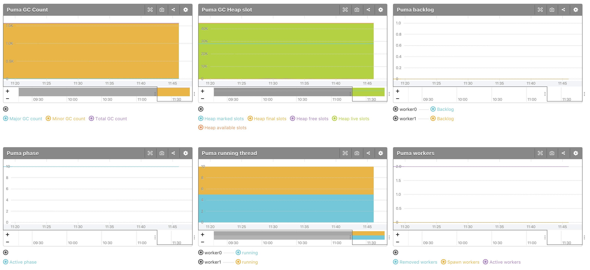

# mackerel-plugin-puma
Mackerel plugin for Puma

## Install

You can install this plugin via `mkr plugin install`

```console
$ mkr plugin install mackerel-plugin-puma
```

## Usage

```
Usage of mackerel-plugin-puma:
  -host string
    	The bind url to use for the control server (default "127.0.0.1")
  -metric-key-prefix string
    	Metric key prefix (default "puma")
  -port string
    	The bind port to use for the control server (default "9293")
  -tempfile string
    	Temp file name
  -token string
    	The token to use as authentication for the control server
  -with-gc
    	Output include GC stats for Puma 3.10.0~
```
## Example mackerel-agent.conf

```
[plugin.metrics.puma]
command = "/opt/mackerel-agent/plugins/bin/mackerel-plugin-puma -token=12345 --with-gc"
```

## Screenshot

